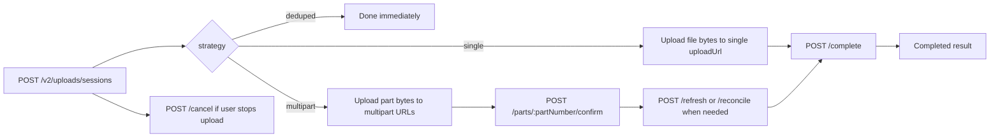

Use `/v2/uploads` when you want the MTN Drive API to manage upload sessions for drive files or photo-backup assets while you handle the actual byte transfer to pre-signed URLs.

## Before You Start

- You already completed [Authentication](/api/authentication) and have a valid bearer token.
- You can calculate the file SHA-256 `contentHash` before session creation.
- You can upload bytes to the returned pre-signed object-storage URLs.
- For `target.kind = photo_backup`, you can send a stable `x-device-id` header and you have already registered the device through [Photo Backup](/api/photo-backup).

## Where managed uploads fit

Use managed uploads as the ingestion layer for new content:

- choose `target.kind = drive` when the result should become a drive file that you later manage with [Drive](/api/drive)
- choose `target.kind = photo_backup` when the result should become a media asset that you later browse with [Photo Backup](/api/photo-backup)

This is the upload surface that new partner integrations should prefer.

Legacy routes such as `/drive/upload-sessions`, `/drive/multipart-sessions`, and `/v1/uploads` still exist for older clients, but this docs set treats `/v2/uploads` as the primary upload contract.

## What `/v2/uploads` does

`/v2/uploads` is the session-orchestration layer for uploads.

It handles:

- dedupe detection
- choosing `single` vs `multipart` upload strategy
- returning pre-signed upload URLs
- tracking confirmed multipart parts
- reconciling interrupted uploads
- completing or canceling the upload session

## Targets

The managed upload API supports two targets:

- `drive`: store a file in MTN Drive, optionally under a `parentId`
- `photo_backup`: store a media asset with optional capture metadata such as `capturedAt`, `width`, and `height`

## Header rule for `x-device-id`

The `x-device-id` header is:

- optional for `drive` managed upload sessions
- required for `photo_backup` managed upload sessions

If you are building one client that can upload both kinds, send the header consistently and keep the value stable per installation or device identity.

## Session lifecycle



## Response strategies

### `deduped`

The API found already-uploaded content and returns a completed result immediately. No byte upload is needed.

### `single`

The API returns one `single.uploadUrl`. Upload the full file in one request, then call `POST /v2/uploads/sessions/:sessionId/complete`.

### `multipart`

The API returns `multipart.partSize` and one or more `multipart.parts`. Upload the required part ranges, call `POST /parts/:partNumber/confirm` for each successful part, then call `POST /complete`.

Use `POST /refresh` if part URLs expire, and `POST /reconcile` after interruptions or uncertain outcomes.

## When to use `refresh` vs `reconcile`

- use `refresh` when you still know the session is active and you mainly need fresh upload descriptors
- use `reconcile` after app restarts, uncertain network outcomes, or when you need the server to tell you what was already accepted

## How to verify this worked

1. Create a session with `POST /v2/uploads/sessions`.
2. Confirm the response returns `strategy: "deduped"`, `"single"`, or `"multipart"`.
3. If the session is `single`, upload the file bytes to `single.uploadUrl`, then call `POST /complete`.
4. If the session is `multipart`, upload each part, confirm each part, then call `POST /complete`.
5. Confirm the completed response contains `result.kind` and either `fileId` or `mediaAssetId`.
6. Use [Drive](/api/drive) or [Photo Backup](/api/photo-backup) to retrieve the newly available content.

## Minimal create-session examples

Drive target:

```bash
curl -X POST https://youthful-fold.pipeops.app/v2/uploads/sessions \
  -H 'Authorization: Bearer api-access-token' \
  -H 'Content-Type: application/json' \
  -d '{
    "target": {
      "kind": "drive",
      "parentId": "folder-id"
    },
    "file": {
      "filename": "receipt.pdf",
      "mimeType": "application/pdf",
      "byteSize": 10485760,
      "contentHash": "aaaaaaaaaaaaaaaaaaaaaaaaaaaaaaaaaaaaaaaaaaaaaaaaaaaaaaaaaaaaaaaa"
    }
  }'
```

Photo-backup target:

```bash
curl -X POST https://youthful-fold.pipeops.app/v2/uploads/sessions \
  -H 'Authorization: Bearer api-access-token' \
  -H 'Content-Type: application/json' \
  -H 'x-device-id: device-123' \
  -d '{
    "target": {
      "kind": "photo_backup",
      "capturedAt": "2026-03-06T09:00:00.000Z",
      "width": 3024,
      "height": 4032
    },
    "file": {
      "filename": "IMG_0001.JPG",
      "mimeType": "image/jpeg",
      "byteSize": 12582912,
      "contentHash": "bbbbbbbbbbbbbbbbbbbbbbbbbbbbbbbbbbbbbbbbbbbbbbbbbbbbbbbbbbbbbbbb"
    }
  }'
```

## What to read next

- [Drive](/api/drive)
- [Photo Backup](/api/photo-backup)
- [API Reference: Managed Uploads](/api/api-reference-managed-uploads)
- [Authentication](/api/authentication)
