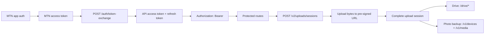

Use this section when you are integrating directly with the MTN Drive HTTP API instead of going through the React Native SDK.

## Before You Start

- You already have a way to obtain the MTN access token from the MTN app sign-in flow.
- You can store the API access token and refresh token securely on the client or broker that will call MTN Drive.
- You are comfortable making authenticated JSON requests and uploading bytes to pre-signed object-storage URLs.

## What these API docs cover

This first API pass is intentionally scoped.

It covers:

- MTN token exchange authentication
- access-token refresh and logout
- bearer-token usage for protected routes
- drive file and folder lifecycle routes
- photo-backup device and media routes
- managed uploads through `/v2/uploads`

It does not cover the broader account-auth endpoints such as signup, login, SSO, OTP, invites, or password reset, and it does not try to fully catalog every legacy upload surface.

## API docs vs SDK docs

Use the [SDK Docs](/sdk/overview) if you want the higher-level React Native integration path with managed adapters, typed SDK errors, and upload task objects.

Use the API docs when you need direct control over:

- the HTTP request/response layer
- token storage and refresh timing
- upload-session orchestration
- pre-signed upload URLs and multipart confirmation
- drive and photo-backup route sequencing

## Start here

- Start with [Authentication](/api/authentication) if you need to exchange the MTN token and call protected routes.
- Go to [Drive](/api/drive) if you need file listing, search, folder creation, metadata, download URLs, and trash/restore flows.
- Go to [Photo Backup](/api/photo-backup) if you need device registration, media listing, download URLs, and thumbnail retrieval.
- Go to [Managed Uploads](/api/managed-uploads) if you need resumable upload-session flows for drive files or photo backup.
- Use [API Reference: Authentication](/api/api-reference-authentication) when you need request and response details.
- Use [API Reference: Drive](/api/api-reference-drive) when you are wiring core drive endpoints.
- Use [API Reference: Photo Backup](/api/api-reference-photo-backup) when you are wiring device and media endpoints.
- Use [API Reference: Managed Uploads](/api/api-reference-managed-uploads) when you are wiring the upload lifecycle endpoint by endpoint.

## High-level flow

## What a direct API integration usually looks like

1. Get the MTN access token from the MTN app auth layer.
2. Exchange it with `POST /auth/token-exchange`.
3. Store the returned API access token and refresh token.
4. Send `Authorization: Bearer <accessToken>` on protected API requests.
5. If you are building photo backup, register the device with `POST /v1/devices/register`.
6. For uploads, create a managed upload session, upload the bytes to the returned URL, then confirm and complete the session.
7. Use `/drive` routes for drive file lifecycle operations and `/v1/media` routes for photo-backup media retrieval.
8. Call `POST /auth/refresh` when the access token expires and `POST /auth/logout` when the session should end.

## What to read next

- [Authentication](/api/authentication)
- [Drive](/api/drive)
- [Photo Backup](/api/photo-backup)
- [Managed Uploads](/api/managed-uploads)
- [API Reference: Drive](/api/api-reference-drive)
- [API Reference: Photo Backup](/api/api-reference-photo-backup)
- [API Reference: Authentication](/api/api-reference-authentication)
- [API Reference: Managed Uploads](/api/api-reference-managed-uploads)
