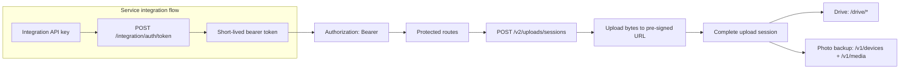

Use this section when you are integrating directly with the MTN Drive HTTP API using a service integration API key.

## Before You Start

- You have an integration API key issued for a service tenant.
- You can store the returned bearer token securely on the client or broker that will call MTN Drive.
- You are comfortable making authenticated JSON requests and uploading bytes to pre-signed object-storage URLs.

## What these API docs cover

This first API pass is intentionally scoped.

It covers:

- service integration API-key exchange
- managed-user provisioning for service tenants
- bearer-token usage for protected routes
- drive file and folder lifecycle routes
- photo-backup device and media routes
- managed uploads through `/v2/uploads`

## API docs vs SDK docs

Use the [SDK Docs](/sdk/overview) if you want the higher-level React Native integration path with managed adapters, typed SDK errors, and upload task objects.

Use the API docs when you need direct control over:

- the HTTP request/response layer
- bearer-token storage timing
- upload-session orchestration
- pre-signed upload URLs and multipart confirmation
- drive and photo-backup route sequencing
- service-tenant user mirroring and storage allocation

## Start here

- Start with [Service Integration](/api/service-integration) if your service authenticates with an integration API key.
- Go to [Drive](/api/drive) if you need file listing, search, folder creation, metadata, download URLs, and trash/restore flows.
- Go to [Photo Backup](/api/photo-backup) if you need device registration, media listing, download URLs, and thumbnail retrieval.
- Go to [Managed Uploads](/api/managed-uploads) if you need resumable upload-session flows for drive files or photo backup.
- Use [API Reference: Service Integration](/api/api-reference-service-integration) when you need request and response details for partner-service auth and managed users.
- Use [API Reference: Drive](/api/api-reference-drive) when you are wiring core drive endpoints.
- Use [API Reference: Photo Backup](/api/api-reference-photo-backup) when you are wiring device and media endpoints.
- Use [API Reference: Managed Uploads](/api/api-reference-managed-uploads) when you are wiring the upload lifecycle endpoint by endpoint.

## High-level flow

## What a service integration usually looks like

1. Receive an integration API key for the service tenant.
2. Exchange it with `POST /integration/auth/token`.
3. Store the returned bearer token securely.
4. If the service needs to manage user-scoped storage or sharing, create or update a managed user with `POST /integration/users`.
5. If a downstream call needs to act on behalf of one managed user, mint a managed-user bearer token with `POST /integration/users/:externalUserId/token`.
6. Send `Authorization: Bearer <accessToken>` on protected API requests.
7. Use `/drive` routes for drive file lifecycle operations and `/v1/media` routes for photo-backup media retrieval.
8. Re-exchange the API key when the bearer token expires.

## What to read next

- [Service Integration](/api/service-integration)
- [Drive](/api/drive)
- [Photo Backup](/api/photo-backup)
- [Managed Uploads](/api/managed-uploads)
- [API Reference: Drive](/api/api-reference-drive)
- [API Reference: Photo Backup](/api/api-reference-photo-backup)
- [API Reference: Service Integration](/api/api-reference-service-integration)
- [API Reference: Managed Uploads](/api/api-reference-managed-uploads)
