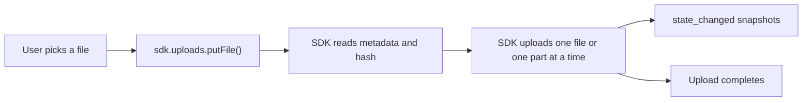
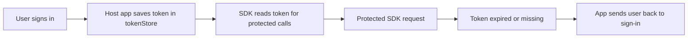
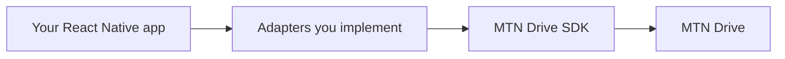

Understand the big ideas behind the MTN Drive SDK before you dive into the reference pages.

## Prerequisites

- You know this SDK is for React Native apps
- You want the high-level picture before following the code examples

## Auth at a high level

Your host app signs the user in first, then stores the MTN access token in `tokenStore`.

The SDK reads that token when it needs to make protected requests. If the token is missing or no longer valid, protected calls fail and your app should send the user back to sign-in.

## Why adapters exist

The SDK handles the MTN Drive workflow, but your app still controls local device behavior.

Adapters are the bridge between the SDK and your app:

- `tokenStore` keeps login state
- `fileAdapter` reads files, hashes them, and uploads bytes
- `uploads.taskStore` restores active uploads after restart
- `deviceIdProvider` identifies one device for photo backup flows

See [React Native Required Interfaces](/docs/rn-interfaces) for the full contracts.

## Visual guide

### Upload flow

Notice the split: your app starts one task, then the SDK handles the upload workflow while your UI listens for snapshots.

### Auth flow

The important part is that the SDK does not invent auth on its own. Your app signs the user in first, then the SDK reuses that stored token.

### Adapter bridge

Adapters are the hand-off point between your app and the SDK. Your app owns local storage, local file access, and device identity; the SDK owns the MTN Drive workflow.

## How upload tasks behave

The default upload API returns a task object, not a one-shot promise.

That gives you:

- progress updates while the upload is running
- pause, resume, and cancel controls
- restore after app restart

The common task states are:

- `running`: the upload is actively making progress
- `paused`: the upload is waiting until you resume it
- `success`: the upload finished
- `error`: the upload stopped because something failed
- `canceled`: the user intentionally stopped the upload

## The two retry layers

The SDK has two different retry ideas, and they solve different problems.

### Request retry

This is the top-level `retryPolicy` you can pass into `createRNClient(...)`.

It applies to ordinary SDK requests such as:

- loading lists
- reading metadata
- checking storage

It does **not** directly control how file bytes are retried inside an upload task.

### Upload-task retry

This is `uploads.managedRetryPolicy` inside the `uploads` config.

It applies to temporary failures during a task-based upload, such as a failed upload part.

That is why a normal list request and a running upload task do not always follow the same retry behavior.

If you are new, leave both retry settings at their defaults until you have a real reason to tune them.

## Why `sdk.uploads` is the default path

For most apps, `sdk.uploads` is the right starting point because it wraps the upload workflow into one consistent task interface.

Use it when you want:

- file upload
- photo backup
- progress updates
- pause/resume/cancel
- restored uploads after restart

See [RN Methods: Managed Uploads](/docs/rn-methods-managed-uploads) for the full task behavior.

## When to use `sdk.client.*`

Use low-level `sdk.client.*` modules only when you need custom control that the task API does not give you.

Examples:

- custom drive browsing
- low-level share management
- manual photo sync orchestration
- storage dashboards

If you are new to the SDK, start with `sdk.uploads` and only drop lower when you know exactly why.
