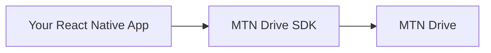

Start here if you need to add MTN Drive uploads or photo backup to a React Native app without learning the whole SDK at once.

## What is MTN Drive?

MTN Drive is a cloud storage product for files, folders, and media backup.

This SDK gives your React Native app a safe way to connect to that storage layer, upload files from the device, and keep upload state in sync with your UI.

## What this SDK helps you build

With `@pipeopshq/mtn-rn-sdk`, you can:

- upload a file from the device into MTN Drive
- back up photos and videos with a task-based API
- show upload progress in real time
- pause, resume, or cancel uploads
- restore in-progress uploads after the app restarts
- drop down to low-level modules only when you need advanced control



## Who this is for

This guide is for teams that:

- are building a React Native app
- already have a host-app sign-in flow
- want the simplest path to file upload or media backup

If you need a complete copy-paste setup, use the [React Native Quickstart](/sdk/quickstart-react-native).

## Start here

- New to the SDK: start with [React Native Quickstart](/sdk/quickstart-react-native)
- Want copy-paste patterns: jump to [Common Recipes](/sdk/common-recipes)
- Already stuck on setup: go to [React Native Troubleshooting](/sdk/rn-troubleshooting)
- Need lower-level control: use the [API Reference](/sdk/rn-sdk-methods-reference)

## Your first upload in 30 seconds

```ts
const task = sdk.uploads.putFile({
  uri: fileUri,
  parentId: null,
});

task.on('state_changed', (snapshot) => {
  console.log(snapshot.bytesTransferred, snapshot.totalBytes);
});
```

This starts one upload task immediately and gives you live progress updates.

## What to read next

- [Install from npm](/sdk/install-npm) if the SDK is not in your app yet
- [React Native Quickstart](/sdk/quickstart-react-native) for the full first working setup
- [Common Recipes](/sdk/common-recipes) for copy-paste task patterns
- [Glossary](/sdk/glossary) if any SDK term is unfamiliar
